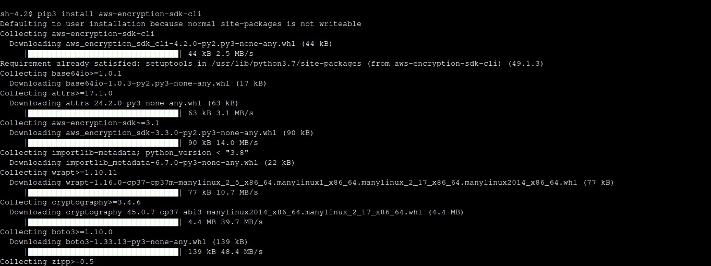
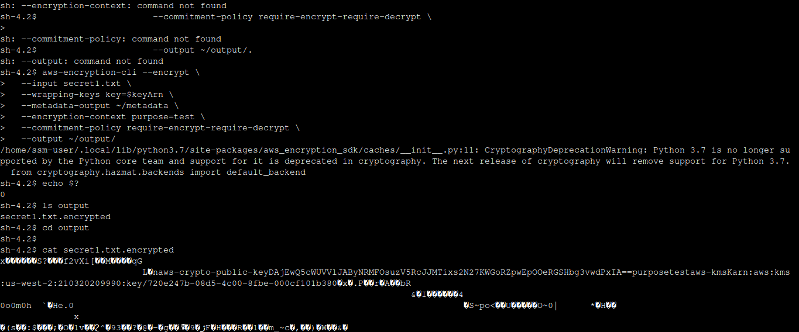
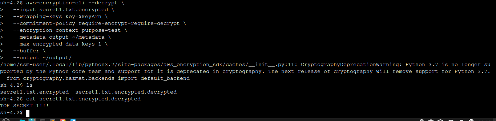

# 🔐 Data Protection Using Encryption — AWS Lab

##Installing the encryption CLI


##Encrypting a file


##Decrypting a file



## 🧭 Overview
This project demonstrates **data protection using encryption** in an AWS environment.  
The lab focuses on using **AWS Key Management Service (KMS)** and the **AWS Encryption CLI** to securely encrypt and decrypt sensitive data stored on an Amazon EC2 instance.

The purpose is to understand how **cryptography** ensures confidentiality, integrity, and nonrepudiation of data in the cloud.

---

## 🧩 Objectives
By completing this lab, you will be able to:
- ✅ Create a symmetric **AWS KMS encryption key**
- ✅ Install and configure the **AWS Encryption CLI**
- ✅ Encrypt plaintext data into ciphertext
- ✅ Decrypt ciphertext back to its original form
- ✅ Understand **symmetric encryption** concepts and their application in AWS

---

## ⚙️ Lab Architecture
- **AWS EC2 instance (File Server)** — hosts text files to be encrypted/decrypted  
- **AWS KMS (Symmetric Key)** — used to perform encryption and decryption  
- **AWS Encryption CLI** — performs file-level encryption operations

**Process flow:**
1. Create a KMS key using AWS Key Management Service.  
2. Configure AWS credentials on the EC2 instance.  
3. Install and set up the AWS Encryption CLI.  
4. Encrypt text files using the KMS key.  
5. Decrypt ciphertext to verify the original content.  

---

## 🔑 Key Commands

### Create KMS Key
```bash
aws kms create-key --description "Key used to encrypt and decrypt data files"

