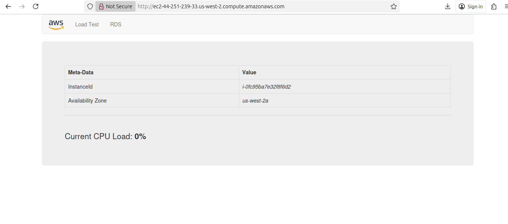

# AWS Cloud Infrastructure with CloudFormation

This project demonstrates how to build a secure, scalable, and automated AWS infrastructure using **AWS CloudFormation** — following Infrastructure as Code (IaC) principles.

## 📘 Project Overview
The goal of this project was to provision a complete AWS environment capable of hosting a web application using CloudFormation templates.  
It automates network setup, security configurations, and application deployment.

---

## 🧱 Architecture Components

- **VPC (Virtual Private Cloud)** — with a `/20` CIDR block for isolation and control.  
- **Subnets** — public and private subnets for separation of web and backend resources.  
- **Internet Gateway** — provides outbound connectivity for public resources.  
- **Route Tables** — configured to route internet-bound traffic through the Internet Gateway.  
- **Security Groups** — control inbound/outbound traffic for the EC2 instance (HTTP and SSH access).  
- **EC2 Instance** — Amazon Linux 2 instance running Apache HTTP Server.  
- **UserData Script** — installs and configures Apache, deploys a sample PHP web application.

---
Web Screenshot in ec2 Server

